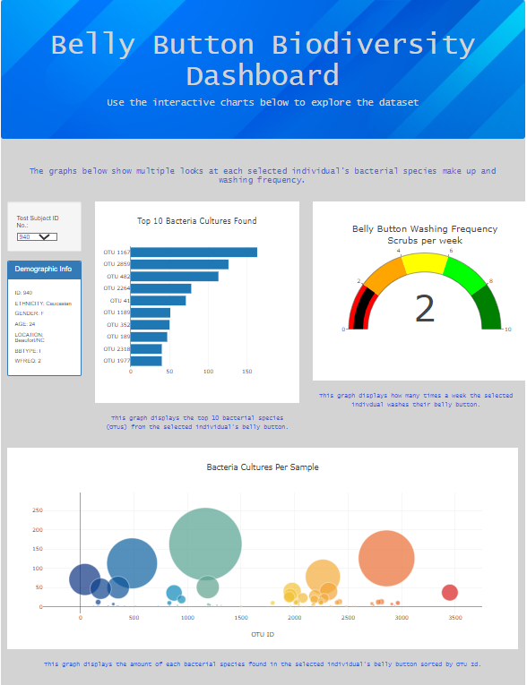

# belly-button-biodiversity

## Overview of Belly Button Biodiversity
We were tasked with building an custom interactive dashboard that allows the user to select an indivdual and display different visuals about the bacterial species found in the selected individuals belly button. The visuals we will be displaying are:
- A list of the selected individuals demographic info: id, ethnicity, gender, age, location, belly button type, and wash frequency.
- A bar chart that displays the top 10 bacterial species (OTUs) from the selected individual's belly button.
- A gauge chart that displays how many times a week the selected indivdual washes their belly button.
- A bubble chart that displays the amount of each bacterial species found in the selected individual's belly button sorted by OTU Id.

### Belly Button Biodiversity Dashboard Link
Webpage accessible at https://trevoriwen.github.io/belly-button-biodiversity/.

